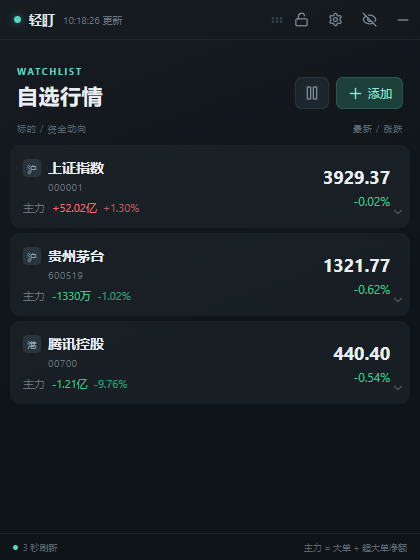

# 轻盯 Market Float

一个适合上班时低调查看 **A 股和港股行情、主力资金**，并可一键伪装成待办便签的 Windows 悬浮窗。

1.14.0 新增自选股分组：支持新建、重命名、删除和手动移动股票，重启后保留分组。完整说明见 [版本说明](docs/RELEASE-1.14.0.md)。



## 它能做什么

- 自选分组支持全部自选、未分组与自定义分组；在股票卡片下方选择所属组。删除分组后股票回到未分组，持仓和提醒保留。
- 自选行情保持 1 秒批量刷新；展开股票的分时与逐笔数据每 3 秒刷新，30 日 K 线和历史资金每 5 分钟刷新，降低接口限流和连接异常
- 盯盘界面支持亮色与暗色主题，可在工具栏即时切换并自动保存
- 展示今日分时、近 20 日主力资金、超大单与大单净额
- 提供 A 股热度排行榜 TOP 10，可一键加入自选
- 提供行业与概念热门板块 TOP 10，按当日主力净流入排序
- 点击热门板块可下钻查看涨幅前 20 成分股，并标注涨幅龙头、资金龙头和有公开依据的人气龙头
- 个股详情展示 30 日 K 线、成交额、量比和按流通市值换算的流通换手率（估算）
- 可为每只股票设置成本价和持仓手数，实时显示盈亏点数、收益率与具体金额，并在 K 线标出成本线
- 可在设置中自定义佣金、最低佣金和卖出印花税，自动估算扣费后的持仓净盈亏
- 持仓盈亏直接显示在自选列表，并可将持仓股票自动置顶
- 支持按涨幅、主力净流入、5/10 分钟资金、量比或持仓盈亏排序
- 提供紧凑列表模式，以及方向键浏览、回车展开、Esc 收起
- 个股详情按需加载并分级缓存，启动时不再批量下载全部历史详情
- 自动标注 5 分钟资金加速、放量站上/跌破均价和临近成本线
- K 线叠加 MA5、MA10、MA30，可分别隐藏或整体收起并保留均值
- 展示今日均价以及近 5 分钟、近 10 分钟主力净流入增量
- 个股详情顶部展示全天固定时间轴分时成交图、分钟成交量和右侧价格刻度；黄线由累计成交额除以累计成交股数计算
- 近 5/10 分钟主力由软件分析最近逐笔成交；大单最低金额可自定义，并显示命中笔数与样本覆盖时间
- 分时图和 30 日 K 线支持鼠标十字定位，可查看精确成交时间、价格、均价、成交量和 OHLC
- 个股详情显示实时买一、卖一价格及挂单量，并提供最近 40 笔逐笔成交的时间、价格、成交量与主动买卖方向
- 新增“机构活跃度估算”：根据近期逐笔大额主动成交的金额占比、出现频率和分钟连续性计算 0–100 分，同时展示活跃等级、资金方向和样本充足度
- 新增“资金动向雷达”：把公开主力资金、机构活跃估算和量化交易特征分层展示；量化特征根据成交频率、间隔规律性、买卖交替率和小单占比计算，并明确标注样本充足度
- 使用 `F8` 打开盯盘、`F7` 打开便签、`F9` 隐藏或恢复窗口，三个快捷键均可自定义
- 支持窗口置顶、透明度、位置锁定、系统托盘
- 支持目标价和涨跌幅提醒
- 支持 A 股与港股，免 API Key
- 所有自选、提醒和待办只保存在本机
- 添加自选窗口可查看并一键恢复已隐藏股票
- 每日规划支持自定义标签、完成勾选和本地日志回看
- 默认便签模式延后行情初始化，并取消自选股后台逐笔扫描，减少启动后的网络请求和资源占用
- 网络请求先使用 Windows 网络配置；系统代理或 TLS 路径异常时自动切换独立直连会话，主行情仍不可用时再切换腾讯备用报价并保留最后有效资金数据

## 下载与使用

在 GitHub Actions 的最新成功构建中下载 Windows 安装版，按向导选择安装位置。软件启动后默认显示工作便签；使用自定义快捷键在便签与行情间切换。

> 未购买商业代码签名证书，Windows 首次运行可能出现 SmartScreen 提示。

## 本地开发

需要 Node.js 22 或更高版本。

```powershell
npm install
npm run dev
```

测试与构建：

```powershell
npm run typecheck
npm test
npm run dist
```

真实 Electron 界面回归（使用独立配置和模拟行情，不修改个人数据）：

```powershell
Remove-Item Env:ELECTRON_RUN_AS_NODE -ErrorAction SilentlyContinue
npx electron scripts/smoke.cjs
# 完成 dist 后，可检查实际打包进 ASAR 的程序
npx electron scripts/smoke.cjs --packaged
```

只读检查公开行情源：`npx electron scripts/network-check.cjs`。结果保存在本机 `outputs/qa`，这些测试数据不参与开源发布。

## 技术栈

Electron · React · TypeScript · Vite · electron-builder

## 数据与风险说明

行情来自无需密钥的公开接口。1 秒是客户端请求频率，不代表数据源每秒更新。“主力净流入”沿用数据源的大单与超大单净额口径，无法据此确认交易者身份。

“机构活跃度估算”是轻盯基于公开逐笔成交自行计算的观察指标，并非同花顺等第三方平台的专有指标，也不能据此确认任何成交来自真实机构。

“样本充足度”只衡量已获取成交数量与时间跨度，不是身份识别准确率。5/10 分钟统计以样本最后一笔成交为窗口终点，跨请求积累、按重复笔数去重，最多保留近 10 分钟、10,000 笔样本；公开接口截断、断网或高成交频率仍可能造成缺样，因此不是完整主力流量。

刷新时段按中国/香港时区的工作日钟点判断，尚未接入交易所节假日日历。休市时接口可能返回最近交易日数据，应以源时间和交易日标记为准。港股资金仅在来源明确返回主力、大单、超大单字段时显示；无有效盘口数量时不伪造买卖一数据。

本项目仅供信息展示和学习交流，不构成投资建议，也不可作为交易或下单依据。公开接口可能延迟、限流、变更或停止服务。

## License

[MIT](LICENSE)
